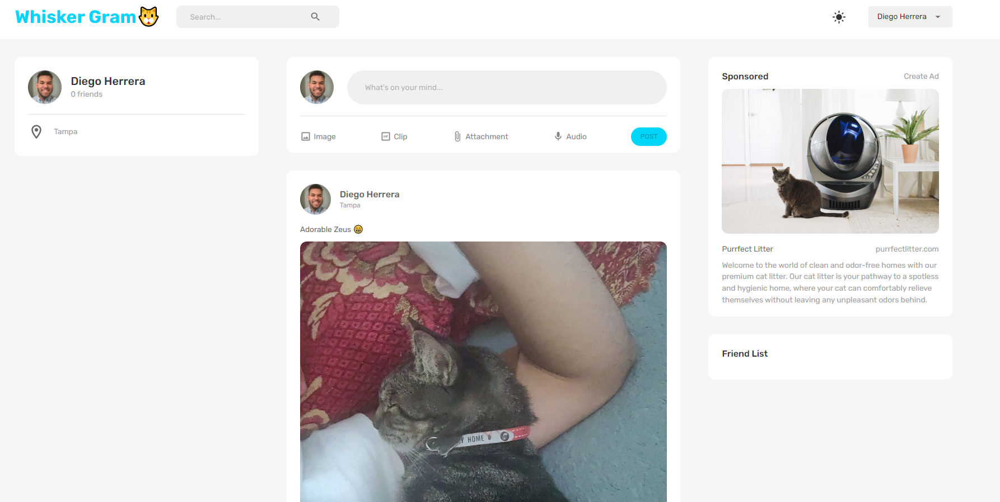

# FUTMEET

Full Stack Social Media App for Felines!

**Link to project:** https://whisker-gram.herokuapp.com/

## How It's Made:

**Tech used:** React/Redux, MUI, Node.js, Express.js, MongoDB, AWS

I built this full-stack website with the idea of creating a site where cat owners can show off their pets, I'm obviously a cat lover and wanted to learn new skills while building a fun website.

## Optimizations

Needed optimizations:

- Create a delete button
- Create comment functionality
- Implement video format

## Lessons Learned:

- I learned how to make beautiful components using Material UI
- How to manage state using Redux
- Authentication using jsonwebtokens
- Implemented aws S3 for file uploads
- Other libraries such as Formik, redux-persist, yup, bcrypt
